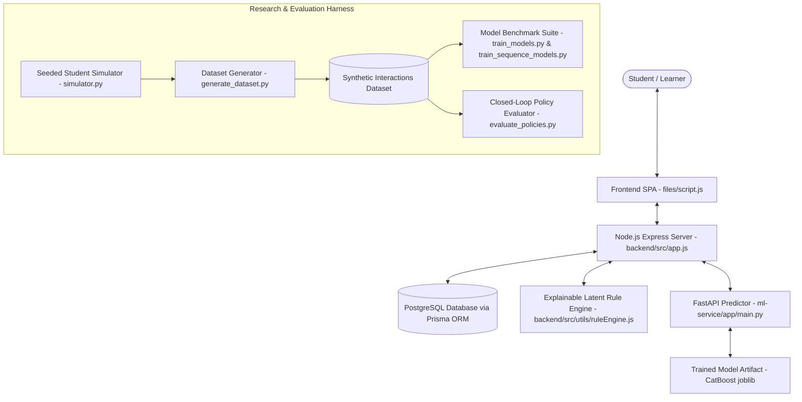
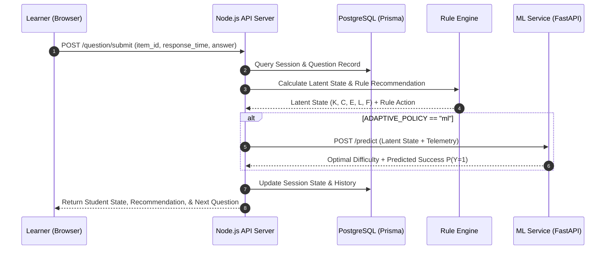

# Adaptive Learning Platform (ALP): Architecture & Design Specification

## System Overview

The Adaptive Learning Platform (ALP) is a research-grade educational technology system engineered to measure the cognitive and behavioral impact of latent-state modeling on student learning efficiency.

---

## Core Components

### 1. Web Application & Client Interface (`files/`)
- **Technology Stack**: HTML5, Vanilla CSS3 (Custom Glassmorphism Design Token System), Modern Vanilla JavaScript (ES2022).
- **Behavioral Instrumentation**: Captures per-question item response time, reading time, interaction latency, retries, option changes, and tab-blur events.

### 2. Backend Orchestrator (`backend/`)
- **Technology Stack**: Node.js, Express, Prisma ORM, PostgreSQL.
- **Question Storage**: 126 hand-crafted, high-quality CSE questions loaded from `backend/src/data/questions/question_bank.csv` via `question_bank_loader.js`.
- **Session Lifecycle**:
  - `POST /question`: Initializes session and stores concept-mapped question bank.
  - `GET /question/start-session`: Fetches initial diagnostic question (easy level).
  - `POST /question/submit`: Validates response, computes 5-dimensional latent state update, requests policy recommendation (Rule vs ML), updates PostgreSQL session state, and selects next optimal item.
  - `GET /roadmap`: Returns the persistent concept prerequisite graph roadmap for a learner.
  - `POST /roadmap/update`: Updates per-learner concept mastery, updates prerequisite DAG state, and persists to PostgreSQL `Learner` table.

### 2b. Dynamic Learning Roadmap Engine (`backend/src/utils/conceptRoadmap.js`)
- **Prerequisite Graph (`backend/src/data/concept_graph.json`)**: 36-concept DAG covering 6 core Computer Science subjects (Data Structures, Algorithms, OOP, DBMS, Operating Systems, Computer Networks).
- **Concept Node States**:
  - `mastered`: Mastery $\ge 0.70$.
  - `in_progress`: Attempted but mastery $< 0.70$.
  - `eligible`: All prerequisite concepts mastered, ready for learning.
  - `locked`: One or more prerequisites unmastered.
- **Target Selection**: Automatically recommends the lowest-mastery `eligible` or `in_progress` concept to guide personalized learning sequences.

### 3. Latent-State Rule Engine (`backend/src/utils/ruleEngine.js`)
- **Latent Dimensions**:
  1. **Knowledge ($\hat{K} \in [0, 1]$)**: Updated via correctness, item difficulty bonus/penalty, multiple attempt decay, and rolling trend.
  2. **Confidence ($\hat{C} \in [0, 1]$)**: Modulated by response time ratio, rapid submission signals, and option switching frequency.
  3. **Engagement ($\hat{E} \in [0, 1]$)**: Sensitive to window switching, pointer movement density, and idle pause duration.
  4. **Cognitive Load ($\hat{L} \in [0, 1]$)**: Derived from difficulty-time incongruity, multiple option toggles, and retry friction.
  5. **Fatigue ($\hat{F} \in [0, 1]$)**: Cumulative metric driven by session duration, question count, and response time drift.

### 4. Machine Learning Service (`ml-service/`)
- **Technology Stack**: Python 3.9+, FastAPI, Uvicorn, Scikit-Learn, XGBoost, LightGBM, CatBoost, PyTorch.
- **Inference Objective**: Predict probability of next item success ($P(Y_{i+1}=1)$) across difficulty candidates and select the item targeting the **desirable difficulty band** ($\approx 0.72$ target probability).

---

## Data Flow & Lifecycle

---

## Design Principles & Security Standards

1. **Explainability**: Every adaptive decision includes human-readable action codes and specific behavioral trigger reasons.
2. **Data Minimization**: High-frequency raw pointer coordinates are aggregated on the client; no biometric keylogging is stored.
3. **Deterministic Evaluation**: Research experiments run with explicit fixed random seeds (`20260726`) to guarantee 100% reproducibility.
